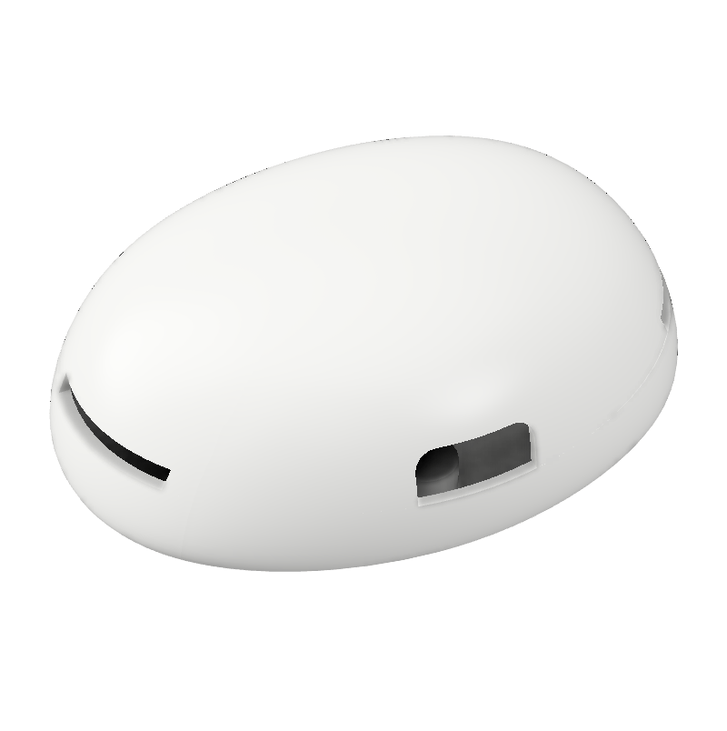
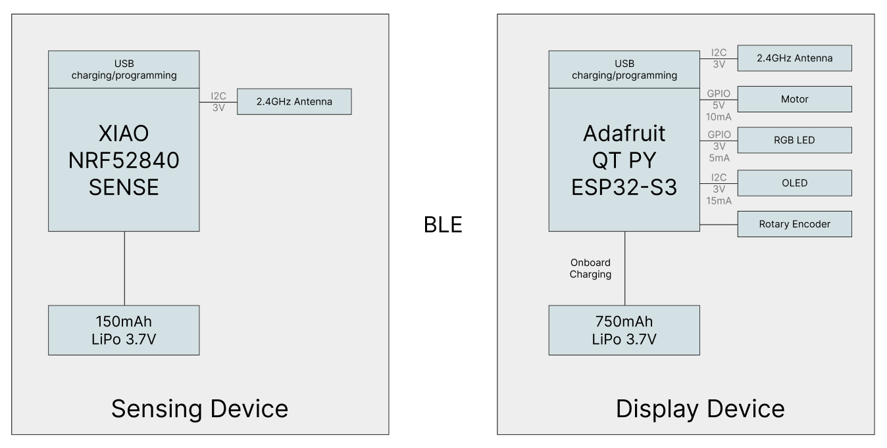

# SIT-UP

SIT-UP features a wearable sensing device and a display unit that work together to monitor and visualize sit-up exercises. The project addresses the challenge of maintaining proper exercise form and tracking workout progress without the need for external supervision. Many individuals struggle with inconsistent posture, lack of real-time feedback, and difficulty staying motivated during workouts. To solve this, the sensing device detects motion using a gyroscope and transmits data via Bluetooth, while the display device provides real-time feedback using an OLED screen, RGB LED, and a stepper motor gauge. Both devices are battery-powered, ensuring portability and seamless workout tracking, allowing users to exercise more effectively and with greater awareness of their form and progress.

### 1. Sensing Device

The sensing device is a wearable unit designed to detect and track sit-up motions using a gyroscope. It processes movement data and wirelessly transmits the information to the display device via Bluetooth. Powered by a 150mAh battery, it is lightweight, compact, and optimized for short workout sessions, ensuring minimal interference with the user’s movements.
 {width=200}

### 2. Display Device

The display device provides real-time visual feedback on the user’s sit-up performance. It utilizes an OLED screen, an RGB LED, and a stepper motor gauge to represent workout progress and exercise quality. With a 750mAh battery, it supports continuous operation, ensuring reliable and engaging feedback throughout the workout session.
 {width=200}

### 3. System Architecture

